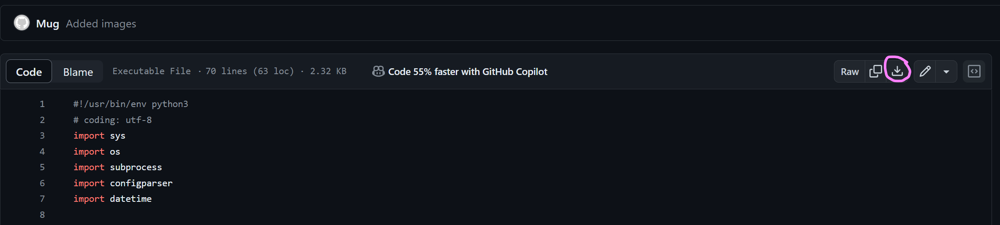

# get-chapter-info

動画に埋め込まれたチャプター情報を
Youtube概要欄へ記載できる形に変換するscriptです

## 前提条件

- python3がインストールされていること
- ffmpegがインストールされていること(pathを通すかget-chapter-info.pyと同じフォルダに置く)
- DaVinciResolveのDeliverページでチャプターを出力した動画であること
  - DaVinciResolveでなくても、チャプターがmetadataに含まれていれば良いはずですが未確認です

----

## 環境セットアップ

### 共通

1. get-chapter-info.pyのDL
[ここ](https://github.com/mug-lab-3/get-chapter-info/blob/main/get-chapter-info.py)のページからDLする


----

### Windows

#### python3

1. [python公式サイト](https://www.python.org/downloads)からDL
2. DLしたインストーラを起動してインストール

#### ffmpeg

1. [ffmpegバイナリ配布サイト](https://www.gyan.dev/ffmpeg/builds/)ここからffmpeg-git-essentials.7z書かれてるところをクリックしてDL
2. DLしたものを展開し、binフォルダに有る`ffmpeg.exe`を`get-chapter-info.py`と同じフォルダに置く

----

### Mac/Linux

それぞれのOSのパッケージマネージャーからffmpeg, pytyon3をインストール

----

## 使い方

1. 下記コマンドを実行
```
python3 get-chapter-info.py <動画ファイルpath>
```

2. 下記のような感じで出力されるので、それをコピペでYoutubeへ貼り付け
   (小数点以下(ミリ秒)は切り捨てです)
```
00:00:00 オープニングトーク
00:00:57 オープニング
00:01:01 基礎
00:33:43 注意点1
00:38:53 注意点2
00:44:45 実践
01:05:15 終わりの挨拶
```


